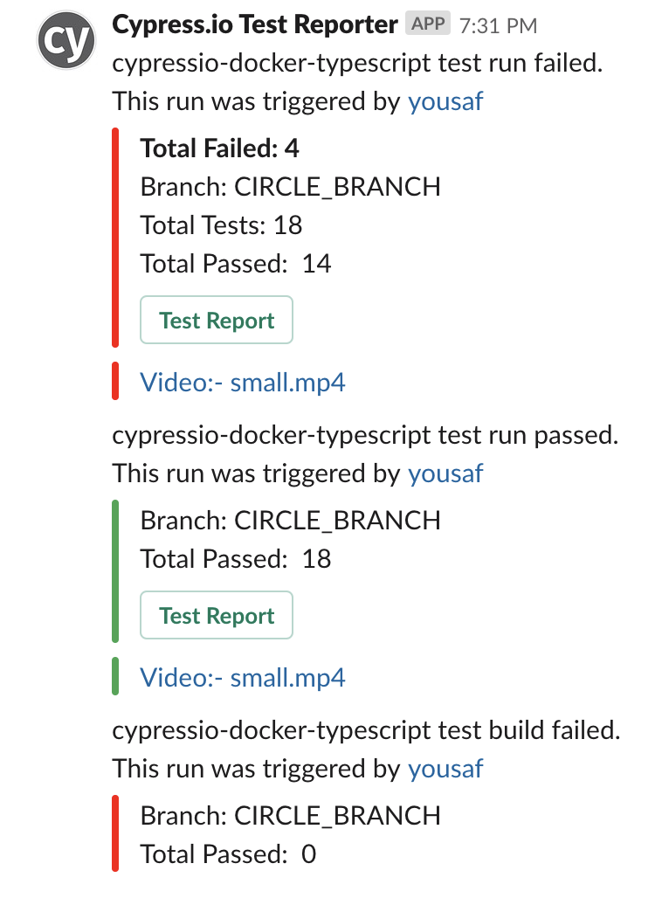

# cypress-slack-reporter

[](https://badge.fury.io/js/cypress-slack-reporter)

[](https://circleci.com/gh/YOU54F/cypress-slack-reporter)
[](https://travis-ci.org/YOU54F/cypress-slack-reporter)
[](https://codeclimate.com/github/YOU54F/cypress-slack-reporter/maintainability)
[](https://coveralls.io/github/YOU54F/cypress-slack-reporter)


A Slack Reporting tool built for Cypress but _should_ work with any mocha based framework that is using [mochawesome](https://github.com/adamgruber/mochawesome/)

<!-- [](https://circleci.com/gh/YOU54F/cypressio-slack-reporter)
[](https://sonarcloud.io/dashboard?id=YOU54F_cypressio-slack-reporter) -->

- Slack reporter with integration with CircleCI
  - Reports Github/BitBucket Triggering Commit Details
  - Reports CirleCI Build Logs / Status / Artefacts
  - Reports Test Status & Provides Report Links
- Takes the output of Mochawesome JSON output to determine test result & corresponding slack message
- Provides a URL link to the Test Artefacts (Mochawesome HTML Test Report / Cypress Video & Screenshots)
- Programatically run Cypress via a script file with full report generation and Slack Reporting.

For users who are not using CircleCi, you can get a simple report

- pass `--ci-provider none` provider flag to provide a simple slack message based on the mochawesome report status
- Pass `--custom-url` along with `--ci-provider custom --custom-url=http://example.com` to set custom report page url. that will be sent to slack.

_NOTE_: Custom URL's do not have trailing forward slashes

For jenkins users

- pass `--ci-provider jenkins` provider flag.

## Reporting Features

It provides the following distinct message types

- Build Failure / Cypress error
- Test Failure
- Test Success

It provides the following information

- CircleCI Build Status
- Test Stats (Total Tests / Passes / Failures)
- Author with link to Github commit
- Branch name
- Pull Request number and link to PR (only if PR)

And the following build/test artefacts

- CircleCI Build Log button
- HTML Test report button (only on build success)
- Videos of test runs (one link per test)
- Screenshots of failed tests (one link per failing test)

### Screenshots showing Slack Alert Format



## Installation

Note _Please see the pre-requisites folder to current neccessary pre-requisites_

1. Install the app

   \$ yarn add cypress-slack-reporter --dev

   or

   \$ npm install cypress-slack-reporter --save-dev

2. Create a Slack app & create an incoming webhook

- [Slack Apps](https://api.slack.com/slack-apps)

Set the following environment variables in your localhost or CI configuration.

- `SLACK_WEBHOOK_URL` - The full URL you created in the last step

  eg. `export SLACK_WEBHOOK_URL=yourWebhookUrlHere`

You can optionally set one or more of the following env vars, to utilise a different slack webhook, dependent on the status of your build or test run.

- `SLACK_WEBHOOK_ERROR_URL` - For failing CI runs
- `SLACK_WEBHOOK_FAILED_URL` - For failing test runs
- `SLACK_WEBHOOK_PASSED_URL` - For passing test runs

Any of the 4 env vars above with accept a comma seperated list of webhooks, if you wish to post your slack message to multiple webhooks (one webhook per channel in slack).

eg. `export SLACK_WEBHOOK_URL=your1stWebhookUrlHere,your2ndWebhookUrlHere`

## Execution

    $ npx cypress-slack-reporter --help

      Usage: index.ts [options]

      Options:
        -v, --version            output the version number
        --vcs-provider [type]    VCS Provider [github|bitbucket|none] (default: "github")
        --ci-provider [type]     CI Provider [circleci|jenkins|bitbucket|none|custom] (default: "circleci")
        --custom-url [type]      On selected --ci-provider=custom this link will be set to Test Report (default: "")
        --report-dir [type]      mochawesome json & html test report directory, relative to your package.json (default: "mochareports")
        --screenshot-dir [type]  cypress screenshot directory, relative to your package.json (default: "cypress/screenshots")
        --video-dir [type]       cypress video directory, relative to your package.json (default: "cypress/videos")
        --verbose                show log output
        --only-failed            only send message for failed tests
        --custom-text [type]     add additional text to message, wrap message in quotes
        -h, --help               display help for command

## Pre-Requisites

- A test tool capable of utilising mochawesome to report results
- [mochawesome](https://github.com/adamgruber/mochawesome/) for json test result generation
- [mochawesome-merge](https://github.com/Antontelesh/mochawesome-merge) to combine multiple mochawesome reports
- [mochawesome-report-generator](https://github.com/Antonteleshmochawesome-report-generator) to generate a HTML report, from your mochawesome json test results
- [cypress-multi-reporters](https://github.com/you54f/cypress-multi-reporters) to allow you to use multple reporters, in case you require other outputs (junit/spec etc)

Yarn installation Instructions

```sh
    yarn add mochawesome --dev
    yarn add mochawesome-merge --dev
    yarn add mochawesome-report-generator --dev
    yarn add cypress-multi-reporters --dev
```

NPM installation Instructions

```sh
    npm install mochawesome --save-dev
    npm install mochawesome-merge --save-dev
    npm install mochawesome-report-generator --save-dev
    npm install cypress-multi-reporters --save-dev
```

- Add the following in the base of your project

cypress.json

```json
{
  ...
  "reporter": "cypress-multi-reporters",
  "reporterOptions": {
    "configFile": "reporterOpts.json"
  }
}

```

reporterOpts.json

```json
{
  "reporterEnabled": "mochawesome",
  "mochawesomeReporterOptions": {
    "reportDir": "cypress/reports/mocha",
    "quiet": true,
    "overwrite": false,
    "html": false,
    "json": true
  }
}
```

## CircleCI

This project is building in CircleCI and can be viewed at the following link

[CircleCI Build](https://circleci.com/gh/YOU54F/cypress-slack-reporter)

See the `.circleci` folder

- `config.yml` - Contains the CircleCI build configuration

The following env vars are read for CircleCI users.

- `CIRCLE_SHA1` - The SHA1 hash of the last commit of the current build
- `CIRCLE_BRANCH` - The name of the Git branch currently being built.
- `CIRCLE_USERNAME` - The GitHub or Bitbucket username of the user who triggered the build.
- `CIRCLE_BUILD_URL` - The URL for the current build.
- `CIRCLE_BUILD_NUM` - The number of the CircleCI build.
- `CIRCLE_PULL_REQUEST` - Comma-separated list of URLs of the current build’s associated pull requests.
- `CIRCLE_PROJECT_REPONAME` - The name of the repository of the current project.
- `CIRCLE_PROJECT_USERNAME` - The GitHub or Bitbucket username of the current project.
- `CI_URL="https://circleci.com/api/v1.1/project"`
- `CIRCLE_PROJECT_ID` - This project ID used in artefact URLS

If you wish to use another CI provider, you can pass any name other than `circleci` into the CLI flag `--ci-provider`, which will allow you to enter your own environment variables for CI.

- `CI_URL`
- `CI_SHA1`,
- `CI_BRANCH`,
- `CI_USERNAME`,
- `CI_BUILD_URL`,
- `CI_BUILD_NUM`,
- `CI_PULL_REQUEST`,
- `CI_PROJECT_REPONAME`
- `CI_PROJECT_USERNAME`

### CircleCI Artifact Notes

CircleCI have recently changed the API for retrieving API's. A URL is generated for artifacts in the format

`https://${CI_BUILD_NUM}-${CI_PROJECT_ID}-gh.circle-artifacts.com/0`

You can get the `CIRCLE_PROJECT_ID` by checking [https://circleci.com/docs/api/#artifacts-of-a-build](https://circleci.com/docs/api/#artifacts-of-a-build)

For example. the ID for this project is `177880476`, you can see it in the following URL

`https://circleci.com/api/v1.1/project/github/YOU54F/cypress-slack-reporter/1/artifacts`

which will return

```json
[ {
  "path" : "root/app/mochareports/.gitignore",
  "pretty_path" : "root/app/mochareports/.gitignore",
  "node_index" : 0,
  "url" : "https://1-177880476-gh.circle-artifacts.com/0/root/app/mochareports/.gitignore"
},
...
]
```

In order to correctly construct your artifact URL, you will need to manually retrieve this ID and set it as an env var titled `CIRCLE_PROJECT_ID`

`EXPORT CIRCLE_PROJECT_ID=177880476`

in windows

`SET CIRCLE_PROJECT_ID=177880476`

or in your CircleCI project's environment page.

There is also another workaround by setting a destination option in store_artifacts job in config.yml (CircleCI).

```
- store_artifacts:
          path: ~/path/to/cypress/videos
          destination: cypress/videos
```

will allow you to access artifacts through
https://${CI_BUILD_NUM}-${CI_PROJECT_ID}-gh.circle-artifacts.com/0/cypress/videos/some_test_result.mp4

This is what it says on CircleCI Documentation:

```
Currently, store_artifacts has two keys: path and destination.

path is a path to the file or directory to be uploaded as artifacts.
destination (Optional) is a prefix added to the artifact paths in the artifacts API. The directory of the file specified in path is used as the default.
```

## Scripted Runner

An example script is [here](./src/cli/spec.ts) as `cli/spec/ts`

A example of how you can use this script in your project to:-

- Run Cypress with Mochawesome & junit reporters
- Merge mochawesome reports with `mochawesome-merge`
- Construct a slack alert with the merged report, screenshots and videos

Either with the cli

```bash
./node_modules/.bin/cypress-slack-reporter-full
```

Or with your own script

```bash
rm -rf ./cypress/reports/mocha && npx ts-node script.ts
```

It can be called with the following options

```
interface SlackRunnerOptions {
  ciProvider: string;
  vcsRoot: string;
  reportDir: string;
  videoDir: string;
  screenshotDir: string;
  customUrl?: string;
  onlyFailed?: boolean;
}
```

And will return a Slack IncomingWebhookResult.

## TODO

- [x] provide user ability to provide own CI artefact paths
- [ ] typescript s3 uploader scripts and add to CLI
  - [x] tsified
  - [x] able to run in isolation
  - [x] mock aws-sdk s3 upload function
  - [x] tests
  - [x] retrieve s3 links for test report/artefacts and inject into the slack report
  - [x] uploading artefacts to s3
  - [ ] add to CLI
  - [ ] programatically run
  - [ ] Add into main slack-reporter script
  - [ ] provide CLI options to provide paths/credentials
- [x] Programatically run
  - [x] provide ability to be programatically run via a script
  - [x] provide example
  - [x] add usage instructions to readme
  - [x] test example
  - [x] compile
- [x] Migrate Slack mock to seperate module available at [npm - slack-mock-typed](https://www.npmjs.com/package/slack-mock-typed)
- Additional CI providers
  - [x] Jenkins

## Contributors


- With thanks to [mikepsinn](https://github.com/mikepsinn) for Jenkins support.
- With thanks to [samswartz13](https://github.com/samswartz13) for bug fixes
- With thanks to [ayushipatel126](https://github.com/ayushipatel126) for dotenv support.
- With thanks to [saikatharryc](https://github.com/saikatharryc) for custom url support.
